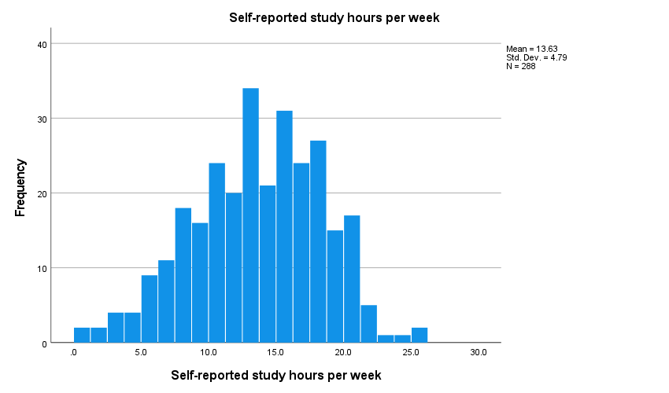
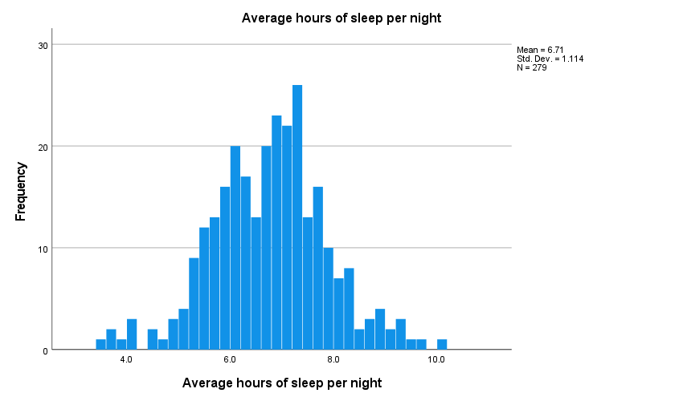
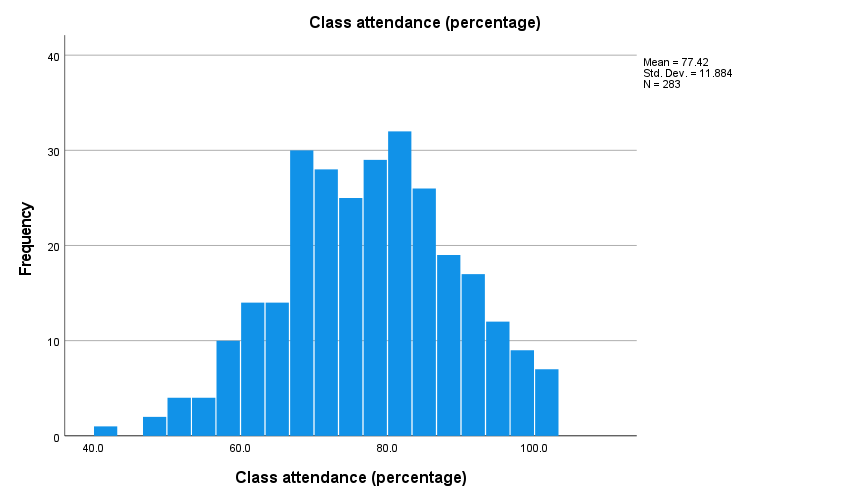

# Assignment 1

## Overview
This project uses a dataset which contains survey information about university students, their stress levels, GPA, weekly study time, average sleep time, and a few other concerned variables.

Main objectives here were to show basic data importing/loading, defining, modifying, and coding variables, dealing with missing values, cleaning duplicate observations, showing descriptive statistics and data visualizations.

This project has no specific research question; it was designed primarily to assess basic data-handling, statistical analysis, and visualization skills in SPSS.

## Variables

|Variable|Variable Label|Value Labels|Measure|
|:---|:---|:---|:---|
|student_id|Student identification number||Nominal|
|gender|Gender of respondent|1 = Male; 2 = Female|Nominal|
|faculty|Faculty of enrolment|1 = Science; 2 = Business; 3 = Arts; 4 = Engineering|Nominal|
|year_of_study|Current academic year||Scale|
|study_hours_week|Self-reported study hours per week||Scale|
|sleep_hours|Average hours of sleep per night||Scale|
|attendance_pct|Class attendance (percentage)||Scale|
|stress1|I feel overwhelmed by coursework|1 = Strongly disagree; 2 = Disagree; 3 = Neutral; 4 = Agree; 5 = Strongly agree|Ordinal|
|stress2|I worry about exams|Same 5-point scale as stress1|Ordinal|
|stress3|I find it hard to relax|Same 5-point scale as stress1|Ordinal|
|stress4|I feel tense about deadlines|Same 5-point scale as stress1|Ordinal|
|stress5|I feel calm and in control (REVERSE-WORDED)|Same 5-point scale as stress1|Ordinal|
|gpa|Grade point average (0.00 - 4.00)||Scale|

## Results

#### Descriptive statistics

| Statistic | Self-reported study hours per week | Average hours of sleep per night | Class attendance (percentage) |
|------------|----------:|----------:|----------:|
| N (Valid) | 288 | 279 | 283 |
| N (Missing) | 12 | 21 | 17 |
| Mean | 13.631 | 6.714 | 77.419 |
| Median | 13.750 | 6.800 | 77.600 |
| Range | 25.2 | 6.5 | 57.9 |
| Minimum | 1.0 | 3.5 | 42.1 |
| Maximum | 26.2 | 10.0 | 100.0 |

#### Faculty-wise student distribution

| Category | Frequency | Percent | Valid Percent | Cumulative Percent |
|----------|----------:|--------:|--------------:|-------------------:|
| Arts       | 58 | 19.3 | 19.3 | 19.3 |
| Business   | 76 | 25.3 | 25.3 | 44.7 |
| Engineering| 77 | 25.7 | 25.7 | 70.3 |
| Science    | 89 | 29.7 | 29.7 | 100.0 |
| Total      | 300 | 100.0 | 100.0 | |

#### Academic year-wise student distribution

| Current academic year | Frequency | Percent | Valid Percent | Cumulative Percent |
|----------------------|----------:|--------:|--------------:|-------------------:|
| 1 | 70 | 23.3 | 23.3 | 23.3 |
| 2 | 75 | 25.0 | 25.0 | 48.3 |
| 3 | 93 | 31.0 | 31.0 | 79.3 |
| 4 | 62 | 20.7 | 20.7 | 100.0 |
| Total | 300 | 100.0 | 100.0 | |

## Visualizations

#### Study hours distribution

#### Sleep hours distribution

#### Attendence distribution

## Full Report

[View the HTML report](use the modified github link here using htmlpreview.github.io)

[View the PDF report](Final Output/assignment1_data_Shah_Md._Tasrif_Rahman.pdf)